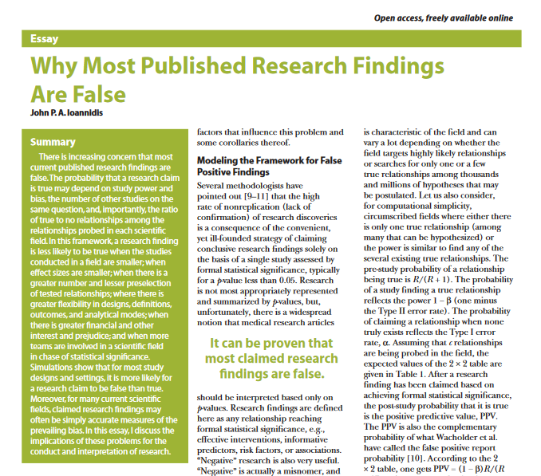
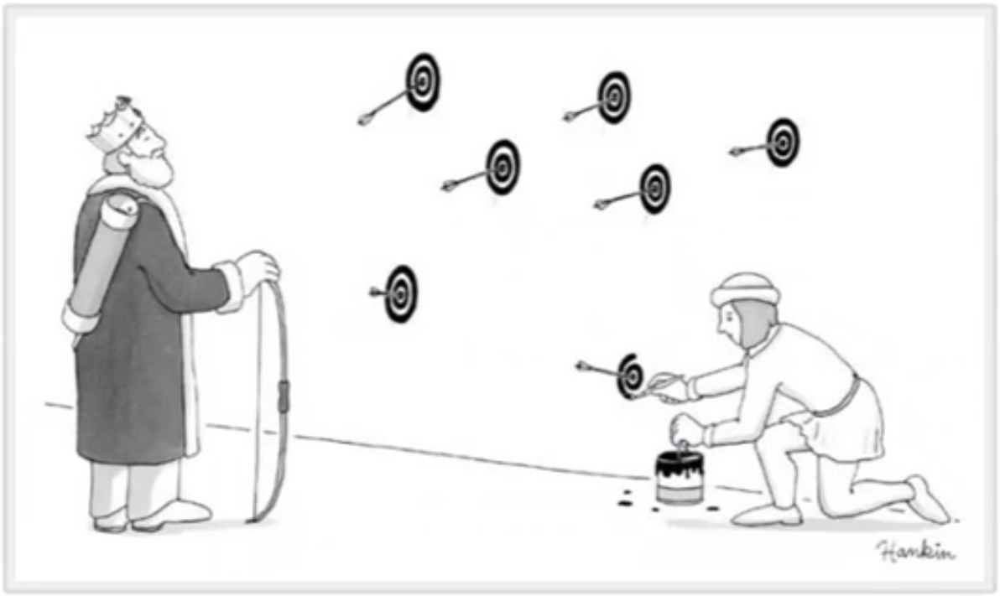
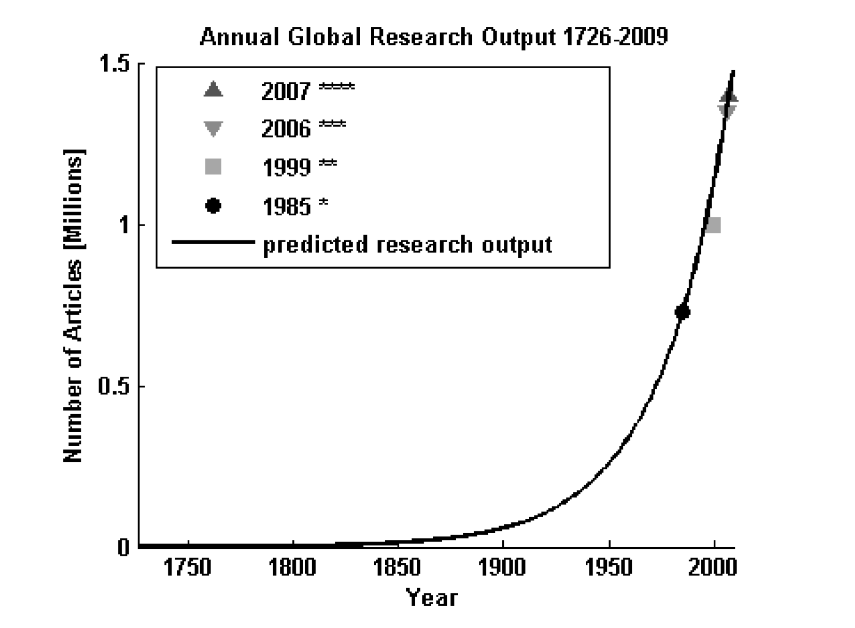
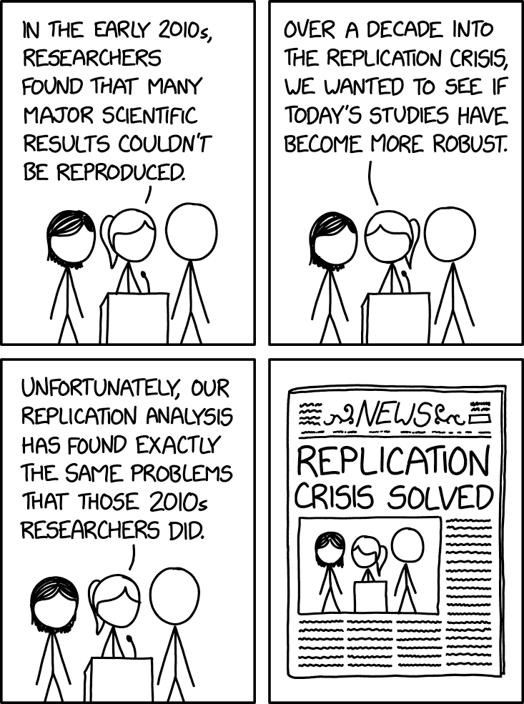
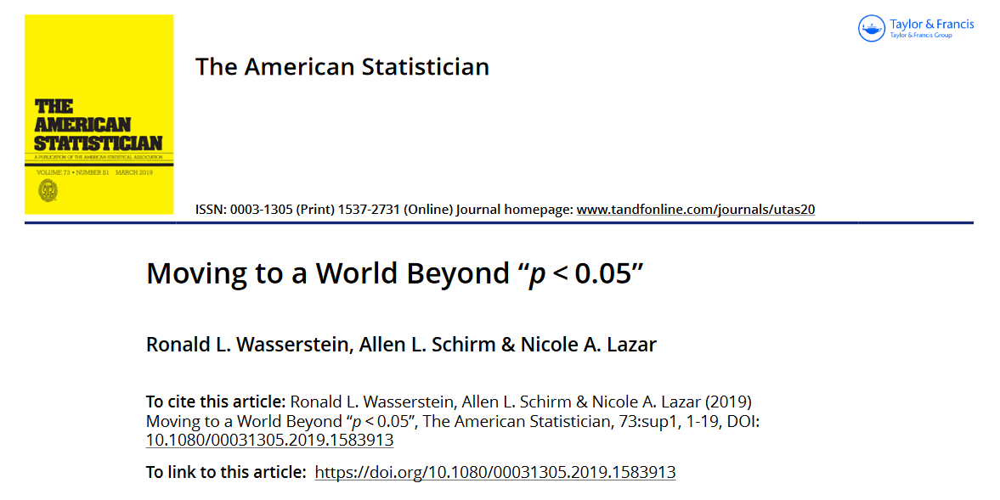
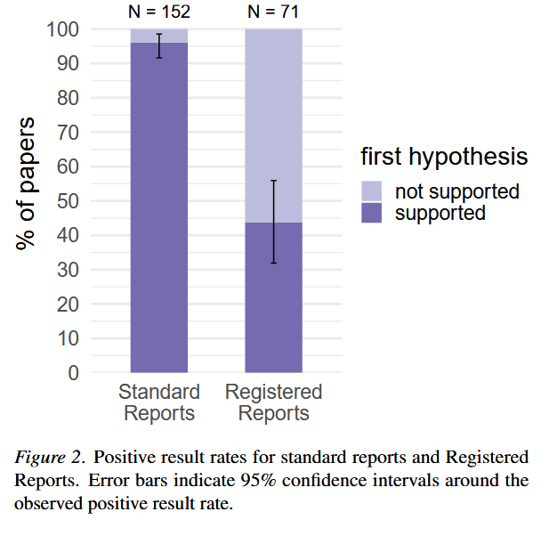
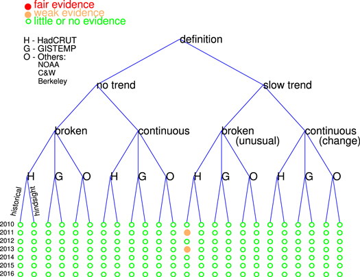
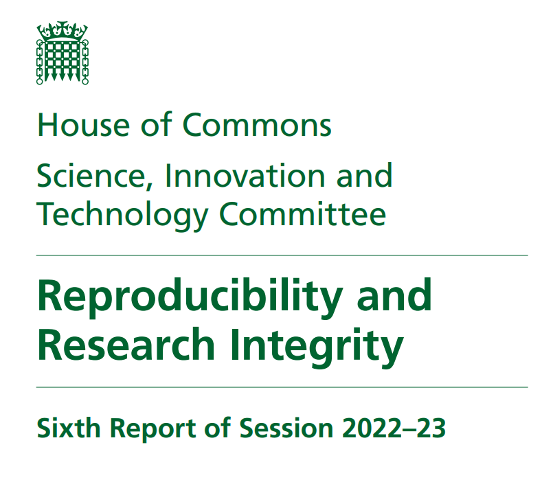
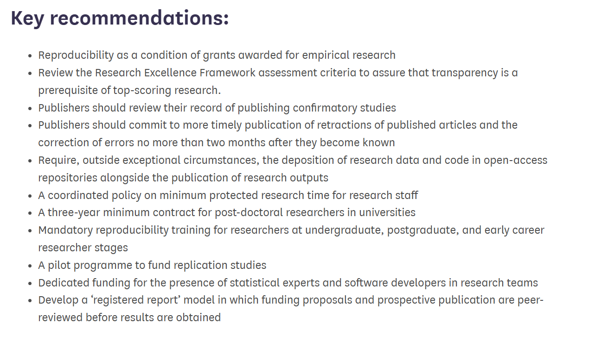

```{r render, eval = FALSE, include=FALSE}
# use quarto installed with Rstudio; set path first time
# Sys.setenv(QUARTO_PATH="C:/Program Files/RStudio/resources/app/bin/quarto/bin/quarto.exe")
# renv::install("leaflet")
library(quarto)
system.time(quarto_render("./index.qmd"))
```

```{r startup}
here::i_am("index.qmd")
library(here)
library(data.table)
library(ggplot2)
```

## Schedule

*This is the old one, to be re-done*

| Time | Topic | Who |
| ----- | ----- | ----- |
| 11:00-11:10 | Causes  | Peter Levy | 
| 11:10-11:20 | Solutions | Fiona Seaton |
| 11:20-11:30 | Open Discussion | All |

## The "Reproducibility Crisis"

Repeated experiments often fail to confirm published results

- Reproducibility of [results]{style="color:red"}, not methods
- Clear problems in psychology, social science & biomedicine.
- Do these problems affect ecology?

# Causes

## Reproducibility Crisis: Causes

1. Publication bias against:
    - negative results
    - confirmation / "me too" results
2. Misinterpretation of statistics
3. Perverse incentives for scientists

## Publication bias & Dark Matter {background="#43464B" background-image="images/milky-way.jpeg"}
```{r darkmatter}
library(magrittr)
library(dplyr)
library(ggplot2)
set.seed(456)
y <- rnorm(10000, 0, 33)
# hist(y)
cutoff <- quantile(y, probs = 0.95)

df_dens <- density(y, from = -100, to = 100) %$%
  data.frame(x = x, y = y) %>%
  mutate(area = x >= cutoff)
names(df_dens) <- c("Effect_size", "Frequency", "Published")
p_dark <- ggplot(data = df_dens, aes(x = Effect_size, ymin = 0, ymax = Frequency, fill = Published)) +
  geom_ribbon() +
  scale_fill_manual(values = c("dark grey", "yellow")) +
  geom_line(aes(y = Frequency)) +
  geom_vline(xintercept = cutoff, colour = "red") +
  annotate(geom = 'text', x = cutoff, y = 0.0125, colour = "red", label = 'Significant at p=5%', hjust = -0.1)
print(p_dark)

# remove the significance level criterion
cutoff <- quantile(y, probs = 0.001)

df_dens <- density(y, from = -100, to = 100) %$%
  data.frame(x = x, y = y) %>%
  mutate(area = x >= cutoff)
names(df_dens) <- c("Effect_size", "Frequency", "Published")
p_light <- ggplot(data = df_dens, aes(x = Effect_size, ymin = 0, ymax = Frequency, fill = Published)) +
  geom_ribbon() +
  scale_fill_manual(values = c("dark grey", "yellow")) +
  geom_line(aes(y = Frequency))
```

Can we only see 5% of the universe?

::: {.notes}
Analogy with dark matter

Meta-analysis - most of it is trying to estimate the unknown latent variable of what is not published
:::

## Misinterpretation of statistics
::: columns
::: {.column width="65%"}

:::
::: {.column width="35%"}
- Misinterpretation<br/>of *p* values<br/> as a guide to truth of results
- => High "false discovery rates"
:::
:::

## Hypothesising after results are known ("HARKing")

::: columns
::: {.column width="35%"}
- "Backwards science"
- Exploratory study presented as confirmation
:::

::: {.column width="65%"}
{width="100%"}
:::
:::

## Perverse incentives
::: columns
::: {.column width="60%"}

:::
::: {.column width="40%"}
*"Publish or perish"*

- incentives for quantity not quality
- stresses peer review
- lower quality
:::
:::

## Expected false discovery rate in ecology

- Ecosystems are highly variable
- Expected effect sizes are generally low
- Properties are hard to measure
- Our mechanistic knowledge is often limited

# Solutions
::: columns
::: {.column width="60%"}
:::
::: {.column width="40%"}

:::
:::

## Changing incentives

::: columns
::: {.column width="70%"}
- Goodharts Law: *"When a measure becomes a target, it ceases to be a good measure"*
- San Francisco Declaration on Research Assessment
- EU CoARA
- Incentivising open sharing of data and code
- Trying to deprioritise "significance" and "novelty"

:::
::: {.column width="30%"}



:::
:::

## Registered reports
{width="50%"}

- publish study design at proposal stage
- allow peer review *before* data collection
- state analysis methods *a priori*
- limits "hypothesising after results are known"
- publish results irrespective of outcome

## Effect of pre-registration

::: columns
::: {.column width="50%"}
Pre-registration dramatically reduces the number of papers where the initial hypothesis is supported by the evidence 
:::
::: {.column width="50%"}

:::
:::

## Multiverse analyses

::: columns 
::: {.column width="50%"}
- Same data, many analysts
- or identify all the options yourself
:::

::: {.column width="50%"}

:::
:::


# Discussion: What should UKCEH be doing to address this?


## UK Parliament Inquiry
::: columns
::: {.column width="30%"}


:::
::: {.column width="70%"}

:::
:::

## Some ideas for UKCEH ...

- training?
- stats support?
- include reproducibility in data management plan?
    - e.g. pre-registration of analyses
- incentives for good practice? 
    - ex/internal reviewing?
    - quality vs quantity of publications
    - publishing negative results & data

