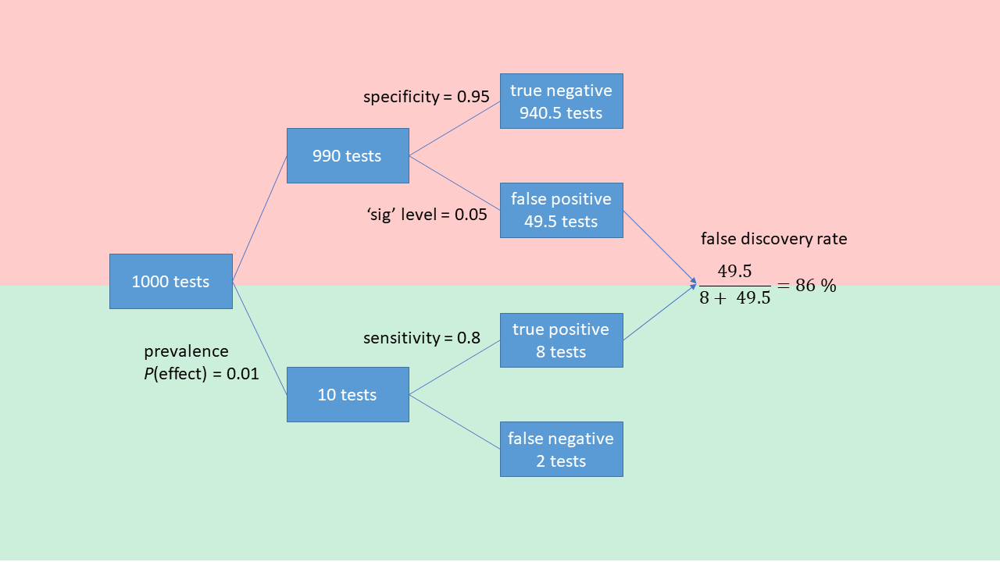
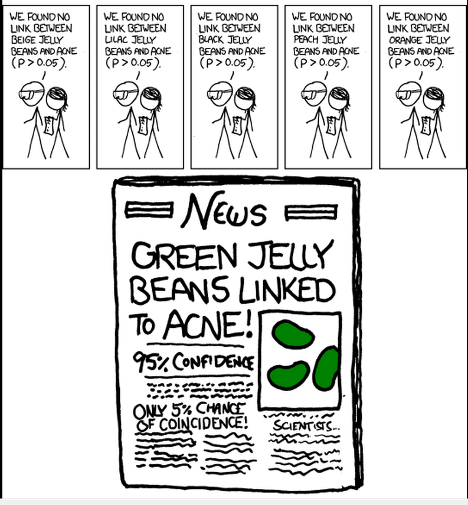
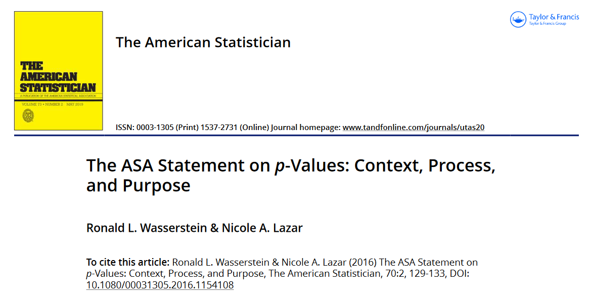

```{r render, eval = FALSE, include=FALSE}
# use quarto installed with Rstudio; set path first time
# Sys.setenv(QUARTO_PATH="C:/Program Files/RStudio/resources/app/bin/quarto/bin/quarto.exe")
# renv::install("leaflet")
library(quarto)
system.time(quarto_render("./index.qmd"))
```

```{r startup}
here::i_am("index.qmd")
library(here)
library(data.table)
library(ggplot2)
library(caTools)
```

## The Reproducibility Crisis
::: columns
::: {.column width="40%"}
Reproducibility<br/>
of [results]{style="color:red"},<br/>
not methods.
<br/><br/>
Better name:<br/>
"*Credibility* crisis"?
:::
::: {.column width="60%"}

:::
:::

::: {.notes}
Results, not methods

Dates back to a landmark paper with arresting title

Now mainstream view - just what statiticians have said for decades about misinterpreting p values

2 causes
:::


::: {.notes}
The first cause is fundamental to how we do science - what Ioannidis' paper was about
:::

## *"Why most published research findings are false"*
High "false discovery rates", often much higher than 5 %

- even when *p* < 0.05

1. Low prior probabilities - unlikely / rare effects
2. Low statistical power - low signal:noise
3. Bias - systematic uncertainties in observation process

::: {.notes}
Crux of Ioannidis' paper was high FDR

3 reasons, last two common in ecology
:::

## The medical screening paradox


::: {.notes}
First of these is the same as the medical screening paradox - familiar from covid

Disesaes are rare in the population - say 1%

Take 1000 people, only 10 will have it
:::

## The effect of low power
```{r plotfdr}
alpha <- 0.05
v_power <- c(0.2, 0.4, 0.8)
v_prior <- seq(from = 0, to = 1, by = 0.01)
v_bias  <- seq(from = 0, to = 1, by = 0.05)
dt <- as.data.table(expand.grid(power = v_power, prior = v_prior, u = v_bias))

# expected fdr, from Colquhoun 2014
dt[, ppv := (prior * power)  / (prior * power  + alpha * (1 - prior))]
dt[, fdr := 1 - ppv]

# without bias, from Ioannidis 2005
dt[, R := prior / (1- prior)] # prior odds
# dt[, PPV := power * R / (R - (1 - power) * R + alpha)]
# with bias, u, from Ioannidis 2005
dt[, ppv_u := (power * R + u * (1- power) * R) /
  (R + alpha - (1 - power) * R + u - u * alpha + u * (1 - power) * R)]
dt[, fdr_u := 1 - ppv_u]

p <- ggplot(dt[power == 0.8], aes(prior, fdr*100, colour = as.factor(power), group = power))
p <- p + geom_line() + ylim(0, 100)
p <- p + xlab("Prior probability") + ylab("False Discovery Rate (%)")
# add legend title
p <- p + scale_color_discrete(name = "Power")
```

```{r lowpower}
p <- ggplot(dt, aes(prior, fdr*100, colour = as.factor(power), group = power))
p <- p + geom_line() + ylim(0, 100)
p <- p + xlab("Prior probability") + ylab("False Discovery Rate (%)")
# add legend title
p <- p + scale_color_discrete(name = "Power")
p
```

::: {.notes}
All predictable with simple calculation
:::

## Low power in ecology

- large background variability cf. effect size
- difficulty of measurement
- small sample size
- measurement error
- measurements are a proxy for true process of interest
    - error not propagated

::: {.notes}
Low power common in ecology
:::

## *"Why most published research findings are false"*

::: columns
::: {.column width="35%"}
- The multiple testing problem
:::

::: {.column width="65%"}
{width="80%"}
:::
:::

::: {.notes}
One way info is filtered is shown by this cartoon

No link between beige

Headline: "Green Jelly Beans ..."

Result is meaningless
:::

## *"Why most published research findings are false"*
- "*The garden of forking paths*"
    - many possible choices in data collection & analysis
    - choices favour finding *interesting* patterns
- Motivated cognition
    - "the influence of motives on memory, information processing & reasoning."
- Journals reject negative or confirmation results

::: {.notes}
Selection needn't be deliberate

Andrew Gelman's phrase - forking paths

In psychology, the term "motivated cognition" - we are pre-disposed to find evidence for things we want to believe

Journals want to publish interesting stories
:::

## Unpublished work as Dark Matter {background="#43464B" background-image="images/milky-way.jpeg"}

```{r darkmatter}
library(magrittr)
library(dplyr)
library(ggplot2)
set.seed(456)
y <- rnorm(10000, 0, 33)
# hist(y)
cutoff <- quantile(y, probs = 0.95)

df_dens <- density(y, from = -100, to = 100) %$%
  data.frame(x = x, y = y) %>%
  mutate(area = x >= cutoff)
names(df_dens) <- c("Effect_size", "Frequency", "Published")
p_dark <- ggplot(data = df_dens, aes(x = Effect_size, ymin = 0, ymax = Frequency, fill = Published)) +
  geom_ribbon() +
  scale_fill_manual(values = c("dark grey", "yellow")) +
  geom_line(aes(y = Frequency)) +
  geom_vline(xintercept = cutoff, colour = "red") +
  annotate(geom = 'text', x = cutoff, y = 0.0125, colour = "red", label = 'Significant at p=5%', hjust = -0.1)
print(p_dark)

# remove the significance level criterion
cutoff <- quantile(y, probs = 0.001)

df_dens <- density(y, from = -100, to = 100) %$%
  data.frame(x = x, y = y) %>%
  mutate(area = x >= cutoff)
names(df_dens) <- c("Effect_size", "Frequency", "Published")
p_light <- ggplot(data = df_dens, aes(x = Effect_size, ymin = 0, ymax = Frequency, fill = Published)) +
  geom_ribbon() +
  scale_fill_manual(values = c("dark grey", "yellow")) +
  geom_line(aes(y = Frequency))
```

We can only see 5% of the universe.

::: {.notes}
Analogy with dark matter

Meta-analysis - most of it is trying to estimate the unknown latent variable of what isn't published
:::

## The ASA statement
::: columns
::: {.column width="50%"}


2016
:::
::: {.column width="50%"}

2019
:::
:::
 Stop using *p* values and "statistical significance".

::: {.notes}
Reproducibility Crisis is accepted as mainstream idea

ASA have had had two Special Issues and Statements saying ...

But not much has changed
:::

## Solutions {background="#43464B" background-image="images/milky-way.jpeg"}
```{r darkmatter2}
print(p_dark)
```

Don't focus on testing a null hypothesis.

::: {.notes}
Solution is simple
:::

## Solutions {background="#43464B" background-image="images/milky-way.jpeg"}
```{r darkmatter3}
print(p_light)
```

Pre-register and publish [all]{style="color:yellow"} results.

<!--- {reproducibility crisis -->

::: {.notes}
but takes time and a shift in culture

But has already happened in medicine
:::


## Registered reports
- publish study design at proposal stage
- allow peer review *before* data collection
- state analysis methods a priori
- prevents multiple testing problem
- publish results irrespective of outcome

## Statistical approach
- don't take data at face value
- represent & propagate their uncertainties
- represent potential biases
- often goes beyond off-the-shelf stats model
- suits Monte Carlo or fully Bayesian approach
- examples ...

## Summary {background="#37a635"}
- Reproducibilty (credibility) crisis arises from:
    - misuse of null-hypothesis testing
    - publication filtered by "significance"
- In ecology, measurement is difficult & indirect ->
    - low statistical power
    - bias in obs process
- We need the same precautions as in medicine
