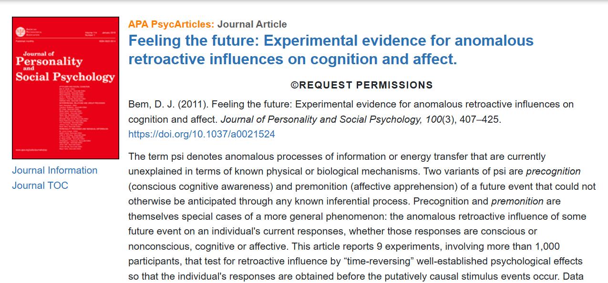
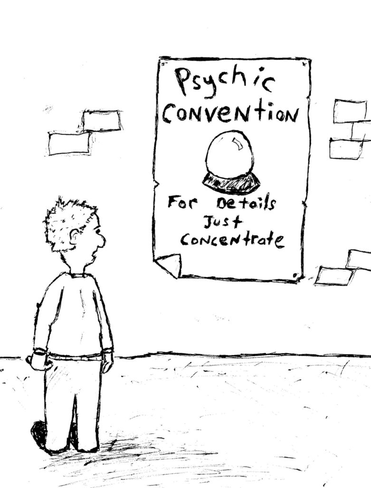
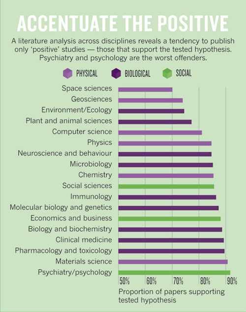
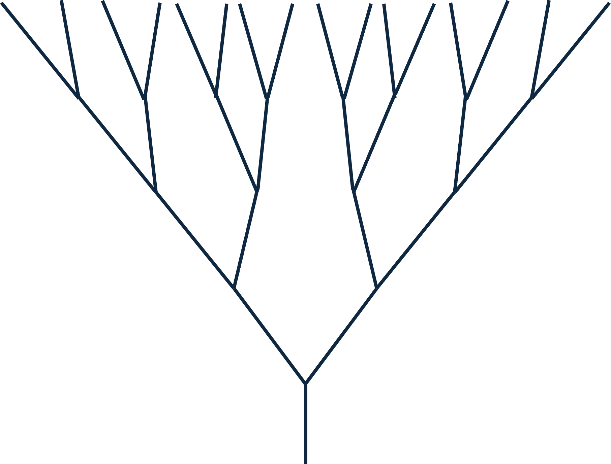
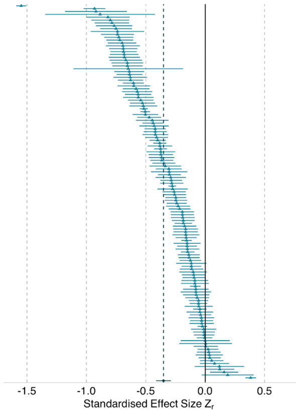

```{r render, eval = FALSE, include=FALSE}
# use quarto installed with Rstudio; set path first time
# Sys.setenv(QUARTO_PATH="C:/Program Files/RStudio/resources/app/bin/quarto/bin/quarto.exe")
# renv::install("leaflet")
library(quarto)
system.time(quarto_render("./index.qmd"))
```

```{r startup}
here::i_am("index.qmd")
library(here)
library(data.table)
library(ggplot2)
```

## Schedule

| Time | Topic | Who |
| ----- | ----- | ----- |
| 11:00-11:10 | Causes  | Peter Levy | 
| 11:10-11:20 | Solutions | Fiona Seaton |
| 11:20-11:30 | Open Discussion | All |

## The "Reproducibility Crisis"

Repeated experiments often fail to confirm published results

- Reproducibility of [results]{style="color:red"}, not methods
- Clear problems in psychology, social science & biomedicine.
- Do these problems affect ecology?

# Causes

## Reproducibility Crisis: Causes

1. Publication bias against:
    - negative results
    - confirmation / "me too" results
2. Misinterpretation of statistics
3. Perverse incentives for scientists

## Publication bias
::: columns
::: {.column width="80%"}


- Results failed to reproduce in other studies
- Journals [would not publish]{style="color:red"} these "negative" studies
:::
::: {.column width="20%"}

:::
:::

## Publication bias & Dark Matter {background="#43464B" background-image="images/milky-way.jpeg"}
```{r darkmatter}
library(magrittr)
library(dplyr)
library(ggplot2)
set.seed(456)
y <- rnorm(10000, 0, 33)
# hist(y)
cutoff <- quantile(y, probs = 0.95)

df_dens <- density(y, from = -100, to = 100) %$%
  data.frame(x = x, y = y) %>%
  mutate(area = x >= cutoff)
names(df_dens) <- c("Effect_size", "Frequency", "Published")
p_dark <- ggplot(data = df_dens, aes(x = Effect_size, ymin = 0, ymax = Frequency, fill = Published)) +
  geom_ribbon() +
  scale_fill_manual(values = c("dark grey", "yellow")) +
  geom_line(aes(y = Frequency)) +
  geom_vline(xintercept = cutoff, colour = "red") +
  annotate(geom = 'text', x = cutoff, y = 0.0125, colour = "red", label = 'Significant at p=5%', hjust = -0.1)
print(p_dark)

# remove the significance level criterion
cutoff <- quantile(y, probs = 0.001)

df_dens <- density(y, from = -100, to = 100) %$%
  data.frame(x = x, y = y) %>%
  mutate(area = x >= cutoff)
names(df_dens) <- c("Effect_size", "Frequency", "Published")
p_light <- ggplot(data = df_dens, aes(x = Effect_size, ymin = 0, ymax = Frequency, fill = Published)) +
  geom_ribbon() +
  scale_fill_manual(values = c("dark grey", "yellow")) +
  geom_line(aes(y = Frequency))
```

Can we only see 5% of the universe?

::: {.notes}
Analogy with dark matter

Meta-analysis - most of it is trying to estimate the unknown latent variable of what is not published
:::

## Misinterpretation of statistics
::: columns
::: {.column width="65%"}

:::
::: {.column width="35%"}
- Misinterpretation<br/>of *p* values<br/> as a guide to truth of results
- => High "false discovery rates"
:::
:::

## High "false discovery rates"
Probability of obtaining *p* < 0.05 when null hypothesis is true is greater when:

1. Low signal:noise (= low "statistical power")
    - small sample size or effect size
    - cf. large variability
2. Bias - unknown systematic effects on observations
3. Weak causal theory
    - many possible alternative models/covariates
    - flexibility in definitions & outcomes

## Hypothesising after results are known ("HARKing")

::: columns
::: {.column width="35%"}
- "Backwards science"
- Exploratory study presented as confirmation
:::

::: {.column width="65%"}
{width="100%"}
:::
:::

## HARKing in practice

::: columns
::: {.column width="75%"}
1. Changing the model to fit the data
    - model form (linear, ...)
    - what variables to include e.g. stepwise regression
    - transformations (log, sqrt, ...)
2. Stopping rules
    - stop collecting data when p < 0.05?
3. Ignoring negative results
    - "file drawering"
:::

::: {.column width="25%"}
{width="100%"}
:::
:::

## Perverse incentives
::: columns
::: {.column width="60%"}

:::
::: {.column width="40%"}
*"Publish or perish"*

- incentives for quantity not quality
- stresses peer review
- lower quality
:::
:::

# Does this apply in ecology?
## Publication bias in ecology?


## Expected false discovery rate in ecology

- Ecosystems are highly variable
- Expected effect sizes are generally low
- Properties are hard to measure
- Our mechanistic knowledge is often limited


## Same data, many analysts

::: columns
::: {.column width="75%"}
- Experiment in Wytham Woods where brood size is either reduced, increased, or stays the same
- Weight and foot length measured for chicks at 14 days old
- Researchers asked: *"To what extent is the growth of nestling blue tits influenced by competition with siblings?"* 
- Gould et al (2025)
:::
::: {.column width="25%"}


:::
:::

## Some decisions to be made....

::: columns 
::: {.column width="60%"}
- What do we use to represent growth?
- What do we use to represent competition with siblings?
- What other variables do we need to take into account?
- How do we take account of the structure of the data (i.e. nests within areas within regions of the wood)?
:::

::: {.column width="40%"}

:::
:::

## Results

::: columns
::: {.column width="65%"}

- Representation of sibling competition resulted in different ranges of analyst-estimated effects:
- Reduced v unchanged: *-0.05* – *0*
- Enlarged v unchanged: *-0.4* – *-0.15*
- Enlarged v reduced: *-0.7* – *-0.15*
- Count post-change: *-0.55* – *-0.2*
- Change in count: *-0.7* – *-0.3*

:::

::: {.column width="35%"}

:::
:::

# Solutions
::: columns
::: {.column width="60%"}
:::
::: {.column width="40%"}

:::
:::

## Changing incentives

::: columns
::: {.column width="70%"}
- Goodharts Law: *"When a measure becomes a target, it ceases to be a good measure"*
- San Francisco Declaration on Research Assessment
- EU CoARA
- Incentivising open sharing of data and code
- Trying to deprioritise "significance" and "novelty"

:::
::: {.column width="30%"}


:::
:::


## Registered reports
{width="50%"}

- publish study design at proposal stage
- allow peer review *before* data collection
- state analysis methods *a priori*
- limits "hypothesising after results are known"
- publish results irrespective of outcome

## Effect of pre-registration

::: columns
::: {.column width="50%"}
Pre-registration dramatically reduces the number of papers where the initial hypothesis is supported by the evidence 
:::
::: {.column width="50%"}

:::
:::

## Many-analyst and multiverse analysis

::: columns 
::: {.column width="50%"}
- Gould et al did a multi-analyst study
- Also possible to do a multiverse analysis where you identify and do all the options yourself (e.g. Risbey et al, 2018)
:::

::: {.column width="50%"}

:::
:::


# Discussion: What should we be doing in UKCEH to address this?


# Supplemental


## UK Parliament Inquiry
::: columns
::: {.column width="30%"}


:::
::: {.column width="70%"}

:::
:::


## Changes in ecological research

::: columns
::: {.column width="50%"}
Much slower

- registered reports introduced by BES
- ...
:::
::: {.column width="50%"}

{width="50%"}
:::
:::


## The ASA statement
::: columns
::: {.column width="50%"}


2016
:::
::: {.column width="50%"}

2019
:::
:::
 Stop using *p* values and "statistical significance".

::: {.notes}
Reproducibility Crisis is accepted as mainstream idea

ASA have had had two Special Issues and Statements saying ...

But not much has changed
:::


## The medical screening paradox


::: {.notes}
First of these is the same as the medical screening paradox - familiar from covid

Disesaes are rare in the population - say 1%

Take 1000 people, only 10 will have it
:::

## The effect of low power
```{r plotfdr}
alpha <- 0.05
v_power <- c(0.2, 0.4, 0.8)
v_prior <- seq(from = 0, to = 1, by = 0.01)
v_bias  <- seq(from = 0, to = 1, by = 0.05)
dt <- as.data.table(expand.grid(power = v_power, prior = v_prior, u = v_bias))

# expected fdr, from Colquhoun 2014
dt[, ppv := (prior * power)  / (prior * power  + alpha * (1 - prior))]
dt[, fdr := 1 - ppv]

# without bias, from Ioannidis 2005
dt[, R := prior / (1- prior)] # prior odds
# dt[, PPV := power * R / (R - (1 - power) * R + alpha)]
# with bias, u, from Ioannidis 2005
dt[, ppv_u := (power * R + u * (1- power) * R) /
  (R + alpha - (1 - power) * R + u - u * alpha + u * (1 - power) * R)]
dt[, fdr_u := 1 - ppv_u]

p <- ggplot(dt[power == 0.8], aes(prior, fdr*100, colour = as.factor(power), group = power))
p <- p + geom_line() + ylim(0, 100)
p <- p + xlab("Prior probability") + ylab("False Discovery Rate (%)")
# add legend title
p <- p + scale_color_discrete(name = "Power")
```

```{r lowpower}
p <- ggplot(dt, aes(prior, fdr*100, colour = as.factor(power), group = power))
p <- p + geom_line() + ylim(0, 100)
p <- p + xlab("Prior probability") + ylab("False Discovery Rate (%)")
# add legend title
p <- p + scale_color_discrete(name = "Power")
p
```

::: {.notes}
All predictable with simple calculation
:::
