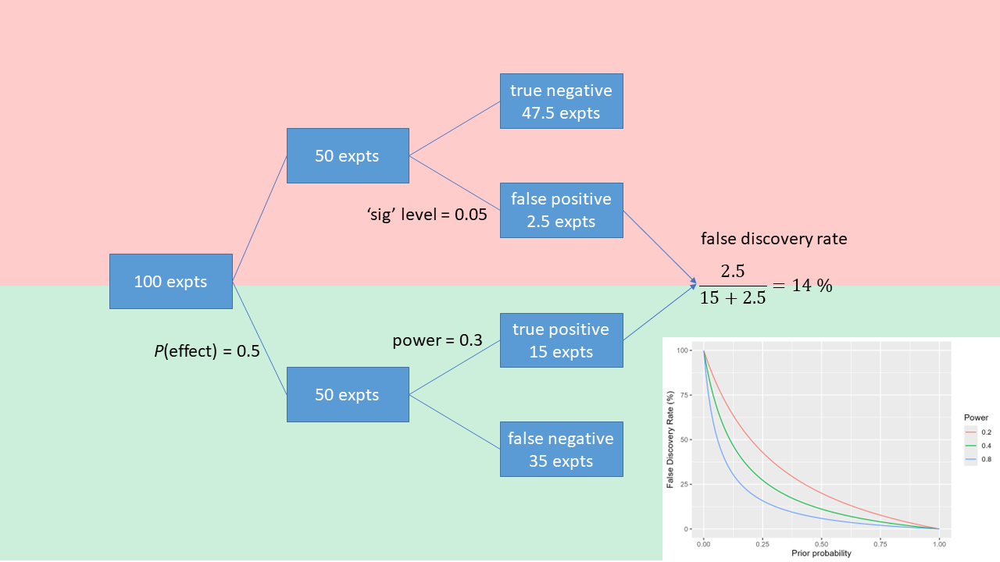

```{r render, eval = FALSE, include=FALSE}
# use quarto installed with Rstudio; set path first time
# Sys.setenv(QUARTO_PATH="C:/Program Files/RStudio/resources/app/bin/quarto/bin/quarto.exe")
# renv::install("leaflet")
library(quarto)
system.time(quarto_render("./index.qmd"))
```

```{r startup}
here::i_am("index.qmd")
library(here)
library(data.table)
library(ggplot2)
library(caTools)
```

## The Reproducibility Problem
::: columns
::: {.column width="40%"}
Reproducibility<br/>
of [results]{style="color:red"},<br/>
not methods.
<br/><br/>
Causes:

- publication filtering
- high false discovery rates
:::
::: {.column width="60%"}
{width="90%"}
:::
:::

::: {.notes}
Results, not methods

Dates back to a landmark paper with arresting title

Now mainstream view - just what statiticians have said for decades about misinterpreting p values

2 causes
:::


::: {.notes}
The first cause is fundamental to how we do science - what Ioannidis' paper was about
:::

## Publication filtering {background="#43464B" background-image="images/milky-way.jpeg"}

```{r darkmatter}
library(magrittr)
library(dplyr)
library(ggplot2)
set.seed(456)
y <- rnorm(10000, 0, 33)
# hist(y)
cutoff <- quantile(y, probs = 0.95)

df_dens <- density(y, from = -100, to = 100) %$%
  data.frame(x = x, y = y) %>%
  mutate(area = x >= cutoff)
names(df_dens) <- c("Effect_size", "Frequency", "Published")
p_dark <- ggplot(
  data = df_dens,
  aes(x = Effect_size, ymin = 0, ymax = Frequency, fill = Published)
) +
  geom_ribbon() +
  scale_fill_manual(values = c("dark grey", "yellow")) +
  geom_line(aes(y = Frequency)) +
  geom_vline(xintercept = cutoff, colour = "red") +
  annotate(
    geom = "text",
    x = cutoff,
    y = 0.0125,
    colour = "red",
    label = "Significant at p=5%",
    hjust = -0.1
  )
print(p_dark)

# remove the significance level criterion
cutoff <- quantile(y, probs = 0.001)

df_dens <- density(y, from = -100, to = 100) %$%
  data.frame(x = x, y = y) %>%
  mutate(area = x >= cutoff)
names(df_dens) <- c("Effect_size", "Frequency", "Published")
p_light <- ggplot(
  data = df_dens,
  aes(x = Effect_size, ymin = 0, ymax = Frequency, fill = Published)
) +
  geom_ribbon() +
  scale_fill_manual(values = c("dark grey", "yellow")) +
  geom_line(aes(y = Frequency))
```

Like Dark Matter, can we only see 5% of the literature/universe?

::: {.notes}
Analogy with dark matter

Meta-analysis - most of it is trying to estimate the unknown latent variable of what isn't published
:::

## False Discovery Rates


## Low power in ecology

- large background variability cf. effect size
- difficulty of measurement
- small sample size
- measurement error
- measurements are a proxy for true process of interest
    - error not propagated
- BUT almost never reported

## Solutions: follow biomedicine
::: columns
::: {.column width="50%"}
{width="50%"}
{width="50%"}

- double-blind trials
- attention to hidden bias
    - placebos etc.
:::
::: {.column width="50%"}
{width="80%"}

- registered reports
- limits "hypothesising after results are known"
- publish results irrespective of outcome
- adopt Bayesian viewpoint
:::
:::

::: {.notes}
Solution is simple
- allow peer review *before* data collection
- state analysis methods *a priori*
:::
